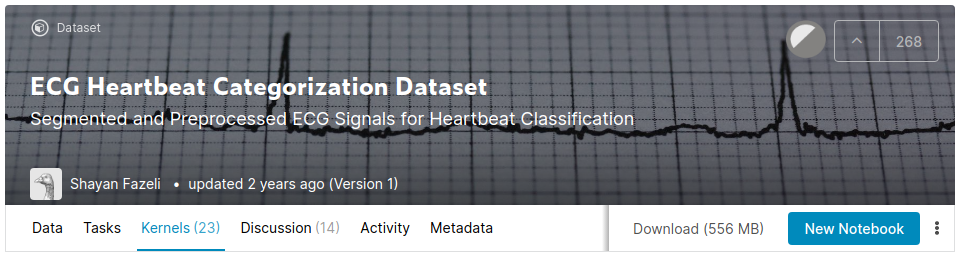

## Notes from the Author

1. The notebook that you may see here came from Kaggle workspace. Kaggle has the functionality to create a new notebook (kernel) based on an existing dataset in their platform. The author would suggest to create a new notebook by clicking the New Notebook button in [this](https://www.kaggle.com/shayanfazeli/heartbeat) page seen below.

2. To reproduce the notebook, copy the cells inside the ecg-heartbeat-categorization-prediction-project.ipynb to your newly-created kernel. Or if you want, you may copy and run all cels from [this](https://www.kaggle.com/eulerium/ecg-heartbeat-categorization-prediction-project) notebook.